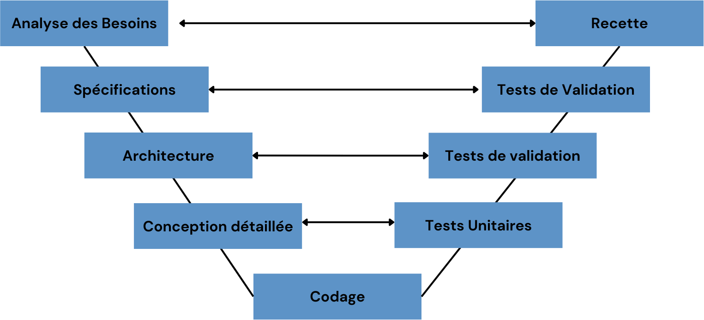
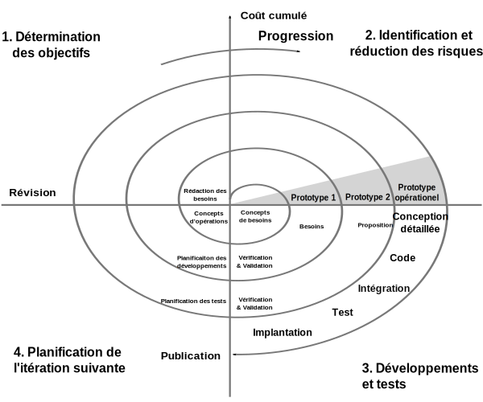

# COURS SUR LES CYCLES DE VIE LOGICIELS ET LES MÉTHODES AGILES

## Historique des cycles de vie

Comprendre pouquoi on est arrivés à l'agilité

### L'idée de base

### En cascade

Cth027, CC BY-SA 4.0 <https://creativecommons.org/licenses/by-sa/4.0>, via Wikimedia Commons

### En 'V'

### En spirale

Mdaumas, CC BY-SA 3.0 <https://creativecommons.org/licenses/by-sa/3.0>, via Wikimedia Commons

## Historique rapide de l'agilité

RAD
XP
Manifest agile
SCRUM
